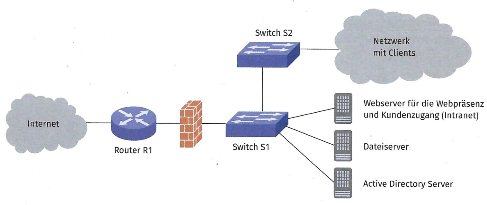
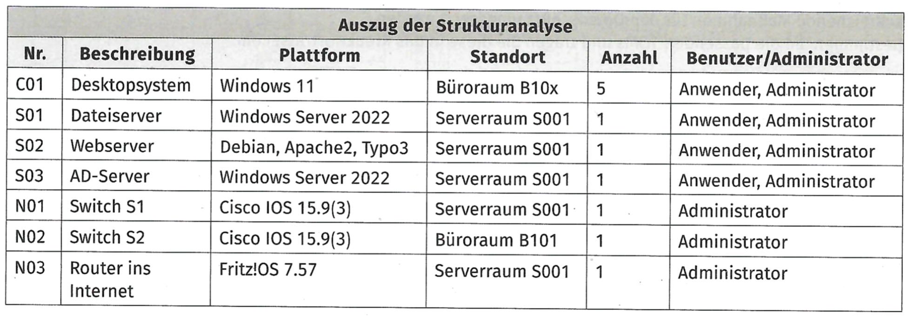

## Aufgabe 1

Sie arbelten bei der Schutzbedarfsanalyse eines neuen Kunden als
Unterstutzung mit. Es llegt ein Plan des Netzwerks vor.

Beschreibung des Kunden: Der Kunde ist eine kleine Werbeagentur mit 5
Mitarbeitenden.

Die 5 Mitarbeitenden arbeiten an Windows-basierten PCs.

Alle Benutzerdaten, wie Projekt- und Kundendaten, werden auf einem
Windows-Dateiserver abgespeichert. Die Benutzer und deren Rechte werden
über ein Active Directory verwaltet.

Ein Auszug aus der Strukturanalyse liegt bereits vor.

a)  Die Schutzbedarfsanalyse ist Teil des Sicherheitsprozesses. Ordnen
    Sie die Reihenfolge der Teilaspekte des Sicherheitsprozesses.

    - Leitlinie zur Informationssicherheit
    - Organisation des Sicherheitéprozesses

    - Sicherheitsprozess initiiert

    - Erstellung einer Sicherheitskonzeption

    - Sicherheitsprozess verbessern

    - Sicherheitskonzeption umgesetzt

<!-- -->

b)  Erstellen Sie für den Dateiserver eine Schutzbedarfsanalyse.
    Bewerten Sie dazu den Schutzbedarf für die drei Schutzziele
    Vertraulichkeit, Integrität und Verfügbarkeit.

    **Beispiel:**

    Grundwert: Vertraulichkeit

    Schutzbedarf: sehr hoch

    Begründung: Auf dem Dateiserver liegen personenbezogene Daten, z. B.
    von Kunden. Diese dürfen nur von berechtigten Personen gelesen
    werden. Sonst kann es zu einem Missbrauch von personenbezogenen
    Daten kommen.

## Aufgabe 2

Die Schutzbedarfsfeststellung für den Webserver liegt vor.

Grundwert: Vertraulichkeit

Schutzbedarf: sehr hoch

Begründung: Auf dem Webserver liegen neben firmeneigenen Daten auch
Daten von Kunden. Diese dürfen nur von berechtigen Personen gelesen
werden. Sonst kann es zu einem Missbrauch von personenbezogenen Daten
kommen.

  

Grundwert: Integrität

Schutzbedarf: sehr hoch

Begründung: Daten auf der Webseite repräsentieren das Unternehmen. Wenn
hier eine unbemerkte Veränderung möglich ist, kann das für das
Unternehmen einen großen Imageschaden bedeuten. Außerdem enthält der
Webserver u. U. personenbezogene Kundendaten. Diese dürfen nicht
unbemerkt verändert werden.

  

Grundwert: Verfügbarkeit

Schutzbedarf: hoch

Begründung: Der Webserver präsentiert die Agentur. Ein Ausfall des
Webservers kann bedeuten, dass die Agentur nicht mehr von Kunden (auch
Neukunden) im Internet erreicht werden kann. Außerdem steht auf dem
Webserver ein Intranetzugang für Kunden bereit. Ein Ausfall ist nur
kurzfristig annehmbar.

a)  Aufgrund des sehr hohen Schutzbedarfs ist eine gesonderte
    Risikoanalyse nötig. Nennen Sie zwei Sicherheitsrisiken, die den
    Betrieb des Webservers betreffen.

<!-- -->

b)  Sie identifizieren einen DDoS-Angriff als mögliches Risiko für den
    Webserver. Bewerten Sie die Eintrittshäufigkeit dieses Risikos.

<!-- -->

c)  Erläutern Sie eine Möglichkeit, einem DDoS-Angriff entgegenzuwirken.

## Aufgabe 3

Diskutieren Sie in Gruppen mögliche Schadenspotenziale für die folgenden
Branchen:

- Apotheken

- Einzelhandel und

- ÖPNV

Benennen Sie mindestens zwei Szenarien für jede Branche im Bereich

## Aufgabe 4

Notieren Sie wesentliche Aspekte aus dem Abschnitt 3.2.1 im grünen Buch
(S. 183--184).
