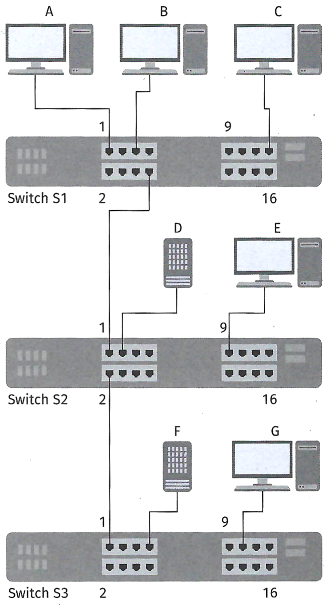

 
::: {.task}
## Aufgabe 1
 
a)  ::: {.subtask}
    Geben Sie die Möglichkeiten an, mit denen die VLAN-Zugehörigkeit
    umgesetzt werden kann.
    :::
Antwort:
 
Portbasiertes VLAN
 
MAC-basiertes VLAN
 
Protokollbasiertes VLAN
 
Benutzerbasiertes VLAN (802.1X / RADIUS)
 
Voice-VLAN
:::
<!-- -->
 
b)  ::: {.subtask}
    Im Netzwerk der Rigudo GmbH soll die Sicherheit für den Zugriff auf
    die unterschiedlichen Unternehmensbereiche erhöht werden. Es wird
    über Alternativen zur bisherigen VLAN-Konfiguration nachgedacht. Die
    einzelnen Rechner bzw. Benutzer sollen ggf. den VLANs zugewiesen
    werden. Erörtern Sie Möglichkeiten für diese Überlegung und
    unterbreiten Sie Vorschläge, welche Lösung man für die
    unterschiedlichen Abteilungen vorsehen sollte.
 
    Entwicklungsabteilung: überwiegend Notebooks, an flexiblen
    Arbeitsplätzen ca. 20 Geräte
 
    Personalabteilung: feste Arbeitsplätze; ca. 10 Geräte
 
    Vertrieb: überwiegend Notebooks, an flexiblen Arbeitsplätzen auch
    Homeoffice bzw. Remote-Zugriff; ca. 40 Geräte
    :::
Antwort:
 
Entwicklungsabteilung (Notebooks, flexibel):
→ Benutzerbasiertes VLAN (802.1X)
 
Personalabteilung (feste Arbeitsplätze):
→ Portbasiertes VLAN
 
Vertrieb (Notebooks, Homeoffice):
→ Benutzerbasiertes VLAN (802.1X) + VPN für Remote-Zugriff
:::
<!-- -->
 
c)  ::: {.subtask}
    Sie wurden wegen Ihrer Erfahrungen bei der Planung von VLANs
    beauftragt, für einen weiteren Kunden die Port-Konfiguration von
    drei Switches zu planen. Geben Sie für die Schnittstellen der
    angeschlossenen Rechner den jeweiligen VLAN-Modus an. Alle Rechner
    sind zunächst in der Standard-Konfiguration (untagged).
 
    Es sollen vier LANs mit den folgenden Zugehörigkeiten umgesetzt
    werden.
 
    - VLAN 10: A, B, D
    - VLAN 20: C, D
    - VLAN 30: B, E
    - VLAN 40: F, G
 
    {width="50%"}
 
| Switch/Port | VLAN-Konfiguration     |
| ----------- | ---------------------- |
| s1/01       | 10; untagged           |
| S1/05       | 30; untagged           |
| S1/08       | 10, 20; tagged         |
| s1/15       | 10, 30; tagged         |
| S2/01       | 20; untagged           |
| S2/02       | 40; untagged           |
| S2/03       | 40; untagged           |
| S2/09       | 10, 20, 30, 40; tagged |
| S3/01       | 30; untagged           |
| S3/07       | 40; untagged           |
| s3/11       | 20; untagged           |
 
 
 
    | Rechner | VLAN-Modus      |
    |---------|---------------- |
    | PC A    |10; untagged     |
    | PC B    | 10, 30; tagged  |
    | PC C    |20; untagged     |
    | PC D    |10, 20; tagged   |
    | PC E    |30; untagged     |
    | PC F    |40; untagged     |
    | PC G    |40; untagged     |
   
:::
 
::: {.task}
## Aufgabe 2
 
Die Rigudo GmbH möchte ihre Firewall-Infrastruktur neu organisieren. Ihr
Unternehmen soll bei der Planung und der Umsetzung unterstützen. Ihr
Abteilungsleiter bittet Sie, mit der Rigudo GmbH zusammenzuarbeiten.
 
a)  ::: {.subtask}
    Bisher verwendet die Rigudo GmbH nur eine Firewall, um den aus- und
    eingehenden Verkehr zu filtern. Um die Vorgaben des BSI zu erfüllen
    soll eine DMZ (Demilitarisierte Zone) eingesetzt werden. Entscheiden
    Sie, welche der folgenden Systeme in der DMZ platziert werden
    müssen.
 
    1.  Webserver -- Enthält die Internetseite der Rigudo GmbH.
    2.  Webserver -- Stellt Kunden der Rigudo GmbH bestimmte Webdienste
        bereit.
    3.  Dateiserver -- Enthält die Benutzerprofile der Beschäftigten.
    4.  Dateiserver Enthält die Nutzdaten der Beschäftigten.
    5.  HTTP-Proxy-Server -- Vermittelt HTTP(S)-Daten weiter.
    6.  AD-Domain-Controller -- Organisiert den Verzeichnisdienst.
    7.  Druckerserver -- Stellt die Druckerwarteschlange bereit.
    8.  E-Mail-Server -- Sendet und empfängt E-Mails.
    9.  DHCP-Server -- Verteilt IP-Adressen.
    :::
Antwort:
In die DMZ gehören:
 
Webserver Website
 
Webserver Kundendienste
 
HTTP-Proxy
 
E-Mail-Server
 
Nicht DMZ:
3, 4, 6, 7, 9
:::
<!-- -->
 
b)  ::: {.subtask}
    Die äußere Firewall der DMZ soll durch eine Paketfilter-Firewall
    umgesetzt werden. Der Paketfilter soll „Stateful Packet Inspection"
    (SPI) unterstützen.
 
    Erstellen Sie zunächst drei Regeln für die Firewall und eine Regel
    für die „Default Policy". DNS-Anfragen von intern sollen erlaubt
    werden, HTTPS-Anfragen von intern sollen ebenfalls erlaubt werden.
    E-Mails sollen versendet werden können. Es soll ein
    Allow-List-Prinzip angewendet werden. Vervollständigen Sie dafür die
    nachfolgende Tabelle.
 
    {width="75%"}
 
 
| Nr. | Ziel-IP-Adresse | Quell-IP-Adresse | Ziel-Port | Quell-Port | Aktion |
| --- | --------------- | ---------------- | --------- | ---------- | ------ |
| 1   | any             | 172.17.0.150     | 53        | any        | ACCEPT |
| 2   | any             | 172.17.0.0/24    | 443       | any        | ACCEPT |
| 3   | any             | 172.17.0.0/24    | 25        | any        | ACCEPT |
| 4   | any             | any              | any       | any        | DROP   |
    :::
 
<!-- -->
 
c)  ::: {.subtask}
    Sie sollen eine Regel anlegen, die einer bestimmten IP-Adresse
    (192.168.0.15) verbietet, HTTPS-Verkehr zu versenden.
 
    Gegeben ist das folgende Regelwerk (sehr reduziert):
 
    | Nr. | Ziel-IP-Adresse | Quell-IP-Adresse | Ziel-Port | Quell-Port | Aktion |
    |-----|-----------------|------------------|-----------|------------|--------|
    | 1   | any             | 192.168.0.15     | 443       | any        | DROP   |
    | 2   | any             | 192.168.0.0/24   | 443       | any        | ACCEPT |
    | 3   |                 |                  |           |            |        |
    | 4   | any             | any              | any       | any        | DROP   |
    | 5   |                 |                  |           |            |        |
 
    Geben Sie an, an welcher Stelle die Regel eingesetzt werden muss.
:::
<!-- -->
 
d)  ::: {.subtask}
    Zwischen der DMZ und dem internen Netzwerk soll eine Firewall vom
    Typ Application Layer Gateway (ALG) zum Einsatz kommen.
 
    Die Firewall soll HTTPS-Verkehr an bestimmte Webseiten unterbinden
    (URL-Filter).
 
    Recherchieren Sie, auf welches Feld des HTTPS-Headers die Firewall
    den HTTPS-Verkehr überprüfen muss.
   :::
   Antwort:
→ Auf das SNI-Feld (Server Name Indication) im TLS ClientHello.
Darin steht die Domain im Klartext.
 
:::
 
::: {.task}
## Aufgabe 3
 
a)  ::: {.subtask}
    Antwort:
    Der Proxy ruft die Daten ab, analysiert den Inhalt, verändert oder filtert ihn (z. B. Malware-Scan, Entfernen unerwünschter Bestandteile, Kompression) und liefert die modifizierten Daten an den Client.
:::
 
<!-- -->
 
b)  ::: {.subtask}
    Die Rigudo GmbH möchte für bestimmte Unternehmensbereiche den
    Zugriff auf inadäquate Inhalte einschränken. Unterbreiten Sie
    Vorschläge, wie dies umgesetzt werden kann.
    :::
Antwort:
 
URL-Filter
 
Inhaltsanalyse / DPI
 
Proxy-Whitelist
 
DNS-Filter
 
Benutzerbasierte Filter (AD-Gruppen)
 
Zeitbasiertes Filtern
:::