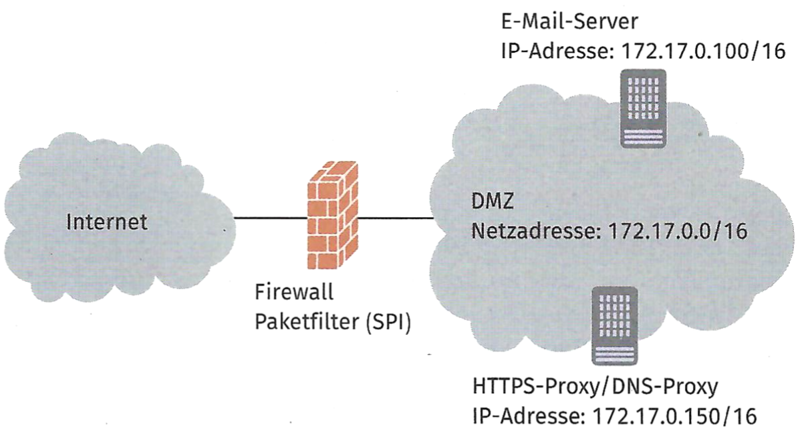
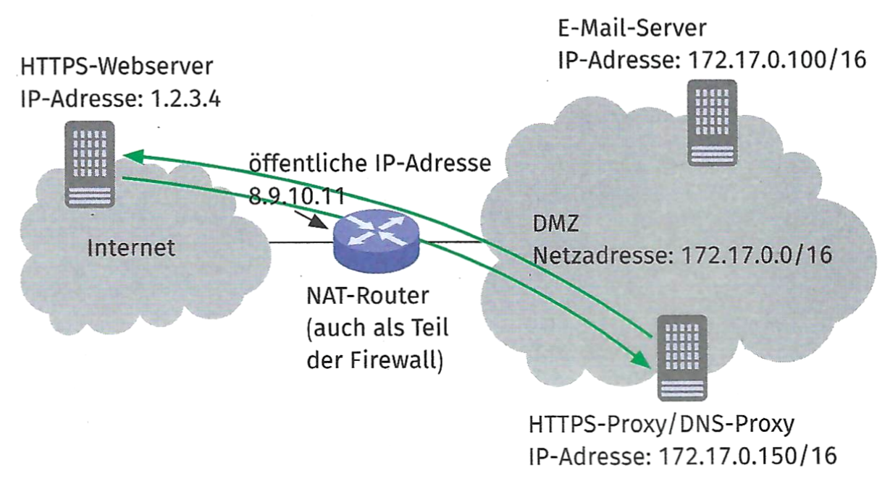

## Aufgabe 1

Beschreiben Sie in eigenen Worten den Unterschied zwischen SNAT und DNAT

## Aufgabe 2

Berechnen Sie den Schlüssel einer VPN-Verbindung, die mit dem
DH-Verfahren gesichert wird. Das System verwendet die Primzahl $p=17$
sowie die öffentlice Zufallszahl $z=20$ und die beiden Geheimzahlen
$a=4$ und $b=5$.

## Aufgabe 3

Nennen Sie mindestens zwei Verfahren, die bei der Verteilung von Paketen
in einem Load Balancer eingesetzt werden. Erklären Sie die jeweiligen
Verfahren kurz.

## Aufgabe 4

Unterscheiden Sie die Begriffe »Public Cloud« und »Private Cloud«.

## Aufgabe 5

In der DMZ der Rigudo GmbH sollen private IP-Adressen zum Einsatz
kommen. Der gewählte IP-Adressbereich lautet 172.17.0.0/16.

Der Mailserver und der HTTPS-Proxy sollen mit dem öffentlichen Netzwerk
kommunizieren können. Sie werden gebeten, den NAT-Einsatz am Router bzw.
an der Firewall zu planen.

::: {.center}
{width="75%"}
:::

a)  Erläutern Sie die Besonderheiten der privaten IP-Adressen.

<!-- -->

b)  Zur Verdeutlichung des NAT-Vorgangs sollen Sie diesen anhand einer
    Verbindung detailliert beschreiben.

    ::: {.center}
    {width="75%"}
    :::

    Der HTTPS-Proxy (172.17.0.150) soll eine Verbindung zu einem
    HTTPS-Webserver (1.2.3.4) aufbauen. Beschreiben Sie den NAT-Vorgang,
    indem Sie die IP-Adressen und Ports der jeweiligen Teilverbindungen
    angeben.

    Teilstrecke 1: HTTPS-Proxy zum Router  
    Teilstrecke 2: NAT-Router zum HTTPS-Webserver  
    Teilstrecke 3: HTTPS-Webserver zum Router  
    Teilstrecke 4: NAT-Router zum HTTPS-Proxy

    | Teilstrecke | Ziel-IP-Adresse | Quell-IP-Adresse | Ziel-Port | Quell-Port |
    |-------------|-----------------|------------------|-----------|------------|
    | 1           | 1.2.3.4         | 172.17.0.150     | 443       | 53000      |
    | 2           |                 |                  |           |            |
    | 3           |                 |                  |           |            |
    | 4           |                 |                  |           |            |

<!-- -->

c)  Die internen Server (z. B. der E-Mail-Server) sollen aus dem
    externen Netzwerk erreichbar sein. Dazu muss eine Portweiterleitung
    in der NAT-Tabelle. des NAT-Routers hinterlegt werden. Der
    E-Mail-Server (172.17.0.100) soll auf Port 25 erreichbar sein. Geben
    Sie den Eintrag in der NAT-Tabelle an. Verwenden Sie die
    nachfolgende Tabelle.

    | Socket intern | Socket extern |
    |---------------|---------------|
    |               |               |
