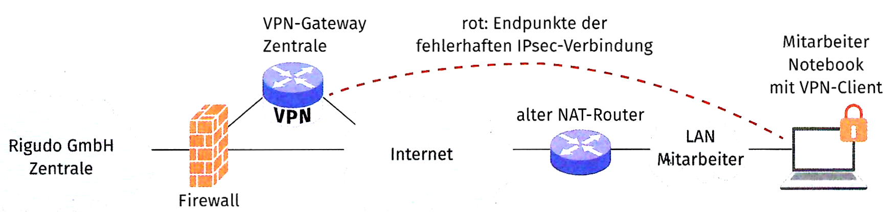

## Aufgabe 1

Die Verfügbarkeit eines Webservices soll erhöht werden. Als Load
Balancing-Verfahren möchten Sie ein schlüsselbasiertes Verfahren
einsetzen. Bei diesem Verfahren wird aus verschiedenen Faktoren, z. B.
aus den Ziel- und Quelladressen sowie Ziel- und Quellports, ein
Hash-Wert gebildet. Pakete mit demselben Hash-Wert werden vom selben
Server bearbeitet.

Beschreiben Sie ein Beispiel, bei dem eine solche Verfahrensweise für
das Load Balancing sinnvoll ist.

## Aufgabe 2

Für die Anbindung der Mitarbeitenden im Homeoffice Soll ein VPN zum
Einsatz kommen. Dieses muss zunächst geplant werden.

a)  Es sollten nur sichere Verfahren zum Einsatz kommen. Geben Sie für
    die folgenden Verfahren an, ob diese sicher bzw. unsicher sind.
    Geben Sie weiterhin an, ob es sich um ein kryptografisches Hash-
    oder ein Verschlüsselungsverfahren handelt.

    | Verfahren | sicher: ja/nein | Art: kryptographischer Hash/Verschlüsselung |
    |-----------|-----------------|---------------------------------------------|
    | Blowfish  |                 |                                             |
    | 3DES      |                 |                                             |
    | SHA-2     |                 |                                             |
    | AES       |                 |                                             |
    | DES       |                 |                                             |

<!-- -->

b)  Im gegebenen Netzwerkplan sollen die neuen VPN-Verbindungen ergänzt
    werden. Ergänzen Sie die Homeoffice-Anschlüsse gemäß den folgenden
    Anforderungen.

    - Mitarbeiter am Standort Zentrale
    - Mitarbeiter am Standort zweite Niederlassung
    - Mitarbeiter per Mobilfunk (Kundengesprache vor Ort) getrennt an
      be1den Standorten

    ::: {.center}
    {width="75%"}
    :::

<!-- -->

c)  Für VPN-Verbindungen mittels IPsec kann der Tunnel- oder
    Transport-Modus genutzt werden. Erläutern Sie die Nachteile des
    Transport-Modus gegenüber dem Tunnel-Modus.

<!-- -->

d)  Die folgenden Hex-Dumps enthalten jeweils den Beginn des AH- und
    ESP-Headers eines entschlüsselten IPsec-Paketes. Der Wert „0x32"
    entspricht dabei dem Feld „Next Header". Am Beginn der Zeilen ist,
    wie im Wireshark üblich, die relative Position (ebenfalls in Hex)
    angegeben. Verwenden Sie die AH- und ESP-Header-Informationen aus
    dem Schülerbuch.

    #### AH-Header

        Bytes Hex-Werte
        0000  32 04 00 00 00 00 02 bc 00 00 00 2b ec d0 29 65
        0010  3b a1 ff 88 01 76 7a bc

    | Next-Header (in Dezimal) | Protokoll |
    |--------------------------|-----------|
    | 1                        | ICMP      |
    | 4                        | IPv4      |
    | 17                       | UDP       |
    | 32                       | MERIT-INP |
    | 50                       | ESP       |
    | 51                       | AH        |
    | 58                       | IPv6-ICMP |
    |                          |           |

    Geben Sie das geschachtelte Protokoll (Next Header) und den
    verwendeten SPI des AH-Headers an.

    #### ESP-Header

        Bytes Hex-Werte
        0000  00 00 02 bd 00 00 00 2b al 61 dc c5 fb 1d fO 14
        0010  66 fa 20 91 fe 77 5d 1c b5 0f bc 5f 3b 26 46 59
        0020  22 d6 d3 f5 c9 63 92 de b5 0d 66 8e 88 3a 5d 5c
        0030  3d d7 32 32 e0 04 97 e0 a3 b6 81 ef 23 8d 3b 92
        0040  2e 40 f4 dO 27 be 74 d8 5a d9 25 b7 71 al 4d d4
        0050  f3 0b 28 8a 99 Ob 6a bb

    Geben Sie den verwendeten SPI und die „Sequence Number" des
    ESP-Headers an.

<!-- -->

e)  Die Mitarbeitenden im Homeoffice haben zum Teil Schwierigkeiten beim
    Aufbau der IPsec-Verbindung mit einem IPsec-Client zur Zentrale.
    Alle anderen Internet-Verbindungen (auch zur Zentrale) funktionieren
    einwandfrei.

    Es sind bei den Mitarbeitenden ältere NAT-Router im Einsatz.
    Diskutieren Sie in der Gruppe die Problematik, die beim Einsatz von
    NAT (ohne weitere Vorkehrungen) auftritt.

    ::: {.center}
    
    :::

## Aufgabe 3

Beschreiben Sie, welcher Konflikt bei der verschlüsselten Speicherung
von Daten in einem Cloud-Speicher und dem Teilen dieser Daten mit
anderen Nutzern besteht.

## Aufgabe 4

Ordnen Sie die entsprechenden Schutzziele der folgenden TOM zu.

a)  Der Serverraum kann nur von berechtigten Personen betreten werden.

b)  Das Serversystem ist als AP-Cluster installiert.

c)  Ein Druckjob kann nur nach Freigabe durch eine PIN durchgeführt
    werden.

d)  Bearbeitete Datensätze werden gezählt

e)  Die Daten werden auf einem Server mit RAID10 abgelegt.

f)  Im Formular können nur bestimmte Werte eingetragen werden.

## Aufgabe 5

a)  Nennen Sie zwei technische und organisatorische Maßnahmen (TOM), mit
    denen das Schutzziel Vertraulichkeit erhöht wird.

<!-- -->

b)  Nennen Sie zwei TOM, mit denen das Schutzziel Integrität erhöht
    wird.

<!-- -->

c)  Nennen Sie zwei TOM, mit denen das Schutzziel Verfügbarkeit erhöht
    wird.
