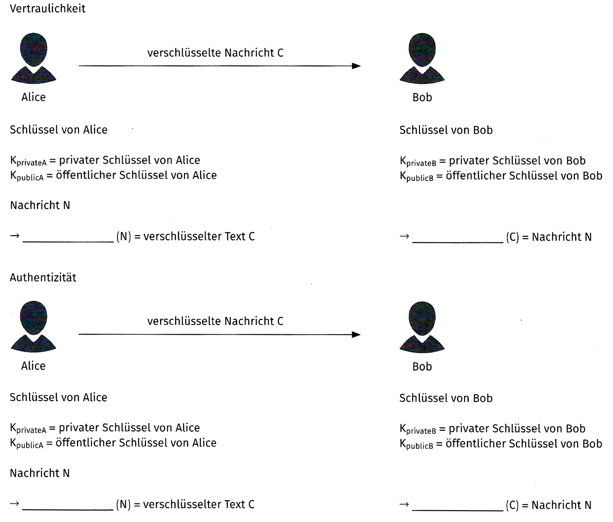
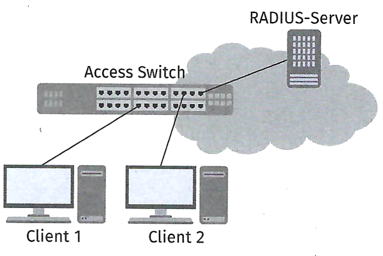

## Aufgabe 1

Sie werden gebeten, eine Einführung in die Verschlüsselungstechnik als
Vortrag anzubieten.

a)  Bereiten Sie eine Folie zum Nachteil „Schlüsselaustausch" bei der
    symmetrischen Verschlüsselung vor.

<!-- -->

b)  Zur besseren Übersicht über den Einsatz von Schlüsseln bei der
    asymmetrischen Verschlüsselung sollen Sie in den Beispielen die
    Schlüssel zuordnen. Ergänzen Sie in den Skizzen die fehlenden
    Schlüssel.

    

<!-- -->

c)  Bei der Rigudo GmbH soll „Port Security" an den Switches eingesetzt
    werden. Dazu soll die Norm IEEE 802.1X zum Einsatz kommen.

    Ordnen Sie die Rollen der Norm IEEE 802.1X den Komponenten zu.

    ::: {.center}
    {width="50%"}
    :::

    | Geräte        | Rolle bei IEEE 802.1X |
    |---------------|-----------------------|
    | Client 1      |                       |
    | Client 2      | Supplicant            |
    | Switch        |                       |
    | RAIDUS-Server |                       |

<!-- -->

d)  Im Gespräch mit anderen Auszubildenden fällt im Zusammenhang mit dem
    RADIUS-Server die Abkürzung „AAA". Einem Auszubildenden fällt das
    Stichwort „Authentifizierung" ein.

    1.  Ergänze die Bedeutung der fehlenden beiden „As":

    2.  Sie können im Gespräch die fehlenden „As" ergänzen.
        „Authentication" und „Authorization" klingen ähnlich, haben aber
        eine unterschiedliche Bedeutung. Unterscheiden Sie die beiden
        Begriffe.

## Aufgabe 2

Für die Absicherung der Kommunikation zwischen Systemen sollen innerhalb
des Netzwerks eines Kunden Zertifikate eingesetzt werden. Sie werden
aufgefordert, eine interne Zertifizierungsstelle planen.

a)  Ein Mitarbeiter fragt, warum Sie nicht einfach die Zertifikate einer
    öffentlichen Zertifizierungsstelle verwenden. Dies würde es
    ersparen, eine eigene Zertifizierungsstelle zu installieren und zu
    konfigurieren. Notieren Sie die Vorteile einer privaten gegenüber
    einer öffentlichen Zertifizierungsstelle.

<!-- -->

b)  Vervollständigen Sie die nachfolgende Vergleichstabelle.

    | Vergleichskriterium | private Zertifizierungsstelle | öffentliche Zertifizierungsstelle |
    |----|----|----|
    | Wer stellt Zertifikate aus? |  | öffentliche Zertifizierungsstelle |
    | Was kostet ein Zertifikat? | geringe bis keine Kosten für die Erstellung eines Zertifikats |  |
    | Welche Konfigurationen können vorgenommen werden? |  |  |
    | Welche Einsatzmöglichkeit besteht? |  | Dienste mit Zugriff aus einem externen Netzwerk |
    | Wie hoch ist der Aufwand für die Einrichtung und Nutzung der CA? |  |  |
    | Ist eine Internetanbindung nötig? |  |  |
    | Wie ist die Vertrauensstellung zum Zertifikat? |  |  |

<!-- -->

c)  Während einer IT-Planungsbesprechung werden Sie gebeten, die
    Zertifizierungsstelle als „Subordinate CA" zu erstellen. Dies würde
    ein höheres Maß an Sicherheit gewährleisten. Beschreiben Sie die
    Vorteile einer „Subordinate CA".

## Aufgabe 3

a)  Nennen Sie zwei Einsatzgebiete, bei denen eine zertifikatsbasierte
    Anmeldung eingesetzt werden kann.

<!-- -->

b)  Beschreiben Sie, wie mithilfe eines Zertifikats eine
    Authentifizierung durchgeführt wird und wie die Gegenstelle
    feststellen kann, dass wirklich der Zertifikatsinhaber die Anmeldung
    durchführen will.

## Aufgabe 4

a)  Erklären Sie, worin der Unterschied zwischen einer
    zertifikatsbasierten Anmeldung und der passwortlosen Anmeldung
    mithilfe des FIDO2-Standards besteht und welche Gemeinsamkeiten
    diese beiden Verfahren haben.

<!-- -->

b)  Mithilfe der Zwei-Faktor-Authentifizierung (2FA) oder einer
    Mehrfaktor-Authentifizierung (MFA) soll der Anmeldeprozess sicherer
    gemacht werden.

    Beschreiben Sie die möglichen Faktoren, die eingesetzt werden
    können.
