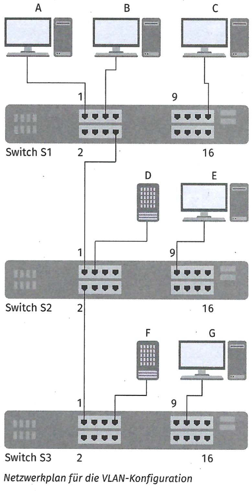
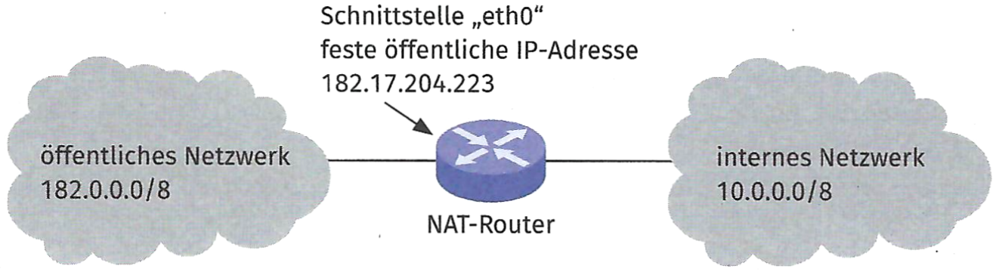
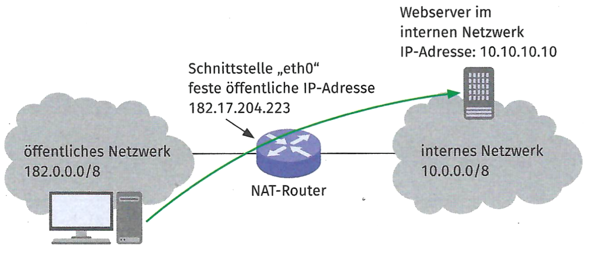

::: {.task}
## Aufgabe 1

a)  ::: {.subtask}
    Erklären Sie den Unterschied zwischen den Parametern „pvid" und
    „taggéd" bei der Konfiguration eines RouterOS-basierten Gerät
    (MikroTik).
    :::

<!-- -->

b)  :::: {.subtask}
    Erstellen Sie für die folgenden Vorgaben eine
    MikroTik-Konfigurationsdatei. Die notwendigen Befehle finden Sie im
    Schülerbuch. Notieren Sie die Konfigurationsdatei.

    ::: {.center}
    {width="40%"}
    :::

    | Switch/Port            | VLAN-Konfiguration              |
    |------------------------|---------------------------------|
    | S1/01 (A)              | 10; untagged                    |
    | S1/05 (B)              | 10, 30; tagged                  |
    | S1/08 (Trunk)          | 10, 20, 30; tagged              |
    | S1/15 (C)              | 20; untagged                    |
    | S2/01 (Trunk)          | 10, 20, 30; tagged              |
    | S2/02 (Trunk)          | 10; tagged zur Sicherheit       |
    | S2/03 (D)              | 10, 20; untagged                |
    | S2/09 (E)              | 30; untagged                    |
    | S3/01 (Trunk)          | 10; tagged zur Sicherheit       |
    | S3/07 (F}              | 10, 40; tagged                  |
    | S3/11 (G)              | 40; uniägged                    |

        # Konfigurationsdatei für Switch S1
        # Administrativer Zugang zu Konfiguration; Optional
        /ip address add address=192.168.0.81/24
        interface=ether1
    ::::
:::

::: {.task}
## Aufgabe 2

Ein Server in der DMZ Rigudo GmbH soll zum Testen der Erreichbarkeit
selbst den Befehl „ping" absetzen können. Er soll aber aus
Sicherheitsgründen nicht per ICMP erreichbar sein.

Sie werden aufgefordert, bei der Erstellung der nötigen Regel zu
unterstützen.

a)  :::: {.subtask}
    Zunächst sollen Sie ein Message Sequence Chart (MSC) erstellen.
    Tragen Sie die ausgetauschten Nachrichten zwischen A und B ein, wenn
    A eine Ping-Anfrage an B stellt. Füllen Sie die unterstehende
    Tabelle,

    ::: {.center}
    {width="35%"}
    :::

    | Nachricht | Name                    | ICMP-Type |
    |-----------|-------------------------|-----------|
    | 1         |                         | 8         |
    | 2         |                         |           |
    ::::

<!-- -->

b)  ::: {.subtask}
    Formulieren Sie eine umgangssprachliche Firewall-Regel für den
    Server. Der Server soll den Befehl „ping" absetzen können, soll aber
    selbst nicht über ICMP erreichbar sein. Verwenden Sie dazu
    Fachbegriffe. (Hinweis: Es funktioniert nicht, wenn der komplette
    ICMP-Datenverkehr geblockt wird.)
    :::

<!-- -->

c)  :::: {.subtask}
    Ein Kunde ruft Sie an. Er hat in seiner Firewall „iptables" eine
    Firewall-Regel hinzugefügt. Seitdem ist keine Interaktion mit dem
    Gerät mehr möglich. Er sendet Ihnen einen Screenshot des Regelwerks.
    Analysieren Sie das Regelwerk und beschreiben Sie den Fehler.

    ::: {text="xs"}
        Chain INPUT (policy DROP)
        target   prot   opt   source     destination
        DROP     all    -     anywhere   anywhere
        ACCEPT   tcp    -     anywhere   anywhere   tcp spts:1024:65535 multiport dports ssh
        ACCEPT   tcp    -     anywhere   anywhere   tcp spts:1024:65535 multiport dports http,https
    :::
    ::::

<!-- -->

d)  ::: {.subtask}
    Diskutieren Sie in Ihrer Lerngruppe, welche sinnvollen Praktiken
    (Best Practices) es bei der Verwendung einer Firewall gibt. Sammeln
    Sie mindesten drei sinnvolle Punkte, die bei der Arbeit mit einer
    Firewall beachtet werden sollten.
    :::
:::

::: {.task}
## Aufgabe 3

Sie sollen einen Proxy-Server (z. B. „Squid") installieren.

a)  ::: {.subtask}
    Erstellen Sie eine Proxy-Konfiguration, die folgende Anforderungen
    erfüllt:

    | Parameter | Wert |
    |----|----|
    | IP-Adresse | 10.100.1.1/16 |
    | Port | 8080 |
    | Filter | alle URLs blockieren, die den Text „stadt-wolkenlos.de" enthalten |
    | Filter | alle Anfragen aus dem lokalen Netz des Proxys dürfen alles |
    | Cache-Verzeichnis | `/usr/local/squid/var/tmplog/` |
    | Cache-Dateiname | squid-cache.log |
    | Cache-Struktur | 1000 MiB mit 8 Ordnern auf Ebene 1 und 128 Ordnern auf Ebene 2 |

    Notieren Sie den Inhalt der Konfigurationsdatei „squid. conf".
    :::

<!-- -->

b)  ::: {.subtask}
    Beschreiben Sie, wie eine Proxy-Konfiguration (z. B. die unter
    Teilaufgabe a erstellte) getestet werden kann.
    :::
:::

:::: {.task}
## Aufgabe 4

a)  :::: {.subtask}
    Ihr Unternehmen hat einen neuen Kunden akquiriert. Dieser verwendet
    intern ein Netzwerk mit IP-Adressen aus dem privaten Bereich
    (10.0.0.0/8). Diese IP-Adressen werden im öffentlichen Netzwerk
    nicht weitergeleitet. Der Kunde benötigt die Kommunikation mit dem
    Internet.

    ::: {.center}
    <figure>
    
    <figcaption aria-hidden="true">NAT-Router im Einsatz</figcaption>
    </figure>
    :::

    Sie werden gebeten, den Kunden bei der Umsetzung zu unterstützen.
    Als NAT-Technik könnte „Masquerade" oder Source-NAT eingesetzt
    werden. Entscheiden Sie sich für eine Technik und begründen Sie Ihre
    Entscheidung.
    ::::

<!-- -->

b)  :::: {.subtask}
    Sie bilden das Szenario aus Aufgabenstellung a) in einer
    Testumgebung nach und setzen die Software „nftables" für den
    NAT-Vorgang ein. Die nachfolgenden Befehle aktivieren das NAT im
    Netzwerk (vgl. Netzwerkplan oben).

    ::: {text="xs"}
        1 nft add table nat
        2 nft 'add chain nat postrouting { type nat hook postrouting priority 100 ; }'
        3 nft add rule nat postrouting ip saddr 10.0.0.0/8 oif ethO snat to 182.17.204.223
    :::

    Erklären Sie dem Kunden die Befehle zeilenweise.

    Zeile 1: legt ein neues übergeordnetes Regelwerk mit dem Namen „nat"
    an  
    ...
    ::::

Der Kunde betreibt einen Webserver im internen Netzwerk. Dieser
Webserver soll vom öffentlichen Netzwerk erreichbar sein.

::: {.center}
{width="80%"}
:::

c)  ::: {.subtask}
    Nennen Sie die Technik, die am NAT-Router eingesetzt werden muss,
    damit der Webserver im internen Netzwerk aus dem öffentlichen
    Netzwerk erreichbar ist.
    :::

<!-- -->

d)  ::: {.subtask}
    Ergänzen Sie die Konfigurationsdatei für die Software „nftables" an
    den entsprechenden Stellen.

        table nat {
          ...
          chain prerouting {
            type nat hook prerouting priority 100; policy accept;
            ip saddr                                iifname "eth1"
            tcp dport {                              }
            dnat to                                    ;
          } 
        }
    :::
::::

::: {.task}
## Aufgabe 5

a)  ::: {.subtask}
    Sie bilden zusammen mit zwei weiteren Auszubildenden ein Projektteam
    für die Arbeit in einer Testumgebung.

    Sie sollen die Verfügbarkeit eines Systems durch den Einsatz eines
    Load Balancers mit der IP-Adresse 10.0.0.99 erhöhen. Die Anwendung
    wartet auf dem Port 1277 auf eingehende Verbindungen. Nach außen
    soll ebenfalls dieser Port aufrufbar sein.

    Sie sollen vier Server verwenden, auf die der Verkehr geleitet wird.
    Die Server haben die IP-Adressen 192.168.0.10/24, 192.168.0.11/24,
    192.168.0.12/24 und 192.168.0.13/24

    Sie setzen die Software „HA-Proxy" ein.

    Erklären Sie Ihrem Team die Konfiguration der Sektion „frontend" der
    Konfigurationsdatei.

        frontend appl
            bind 10.0.0.99:1277
            default_backend appl_backend

    Zeile 1: markiert den Beginn der Sektion „frontend" mit dem Namen
    „app1"  
    ...
    :::

<!-- -->

b)  ::: {.subtask}
    Vervollständigen Sie die Konfiguration für die Sektion „backend".

        backend backend_app1l
            server appl_server1

    Erklärung: Die Server, auf die der Datenverkehr verteilt werden
    soll, werden mit IP-Adresse und Port angegeben.
    :::

<!-- -->

c)  ::: {.subtask}
    Erstellen Sie eine Skizze des Netzwerks aus Teilaufgabe a).
    Beschriften Sie die eingesetzten Geräte mit Ihrer jeweiligen
    IP-Adresse.
    :::
:::

::: {.task}
## Aufgabe 6

Die zuvor geplanten VPN-Anbindungen von Mitarbeitenden in Homeoffice
sollen nun eingerichtet werden. Sie wurden beauftragt, die Konfiguration
des VPN-Gateways anzupassen.

a)  ::: {.subtask}
    In den Unterlagen des VPN-Gateways finden Sie den Hinweis, dass das
    VPN-Gateway mit der Software „strongSwan" aufgebaut wurde. Geben Sie
    die für die Konfiguration wesentlichen Module, Schnittstellen und
    Dateien an. Erläutern Sie für jedes Element die Aufgabe.

    | Element | Aufgabe |
    |----|----|
    | /etc/strongswan.conf | In dieser Datei wird die Grundkonfiguration der Module abgelegt. Diese Parameter gelten übergreifend für alle Verbindungen und müssen so nicht bei jeder Verbindung explizit angegeben werden. Diese Datei kann auch im Ordner „/etc/strongswan.d/" abgelegt werden. |
    | /etc/swanctl.conf |  |
    | swanctl |  |
    | charon |  |
    | IPsec Konfiguration |  |
    :::

<!-- -->

b)  ::: {.subtask}
    Für die Umsetzung der VPN-Tunnel werden PKI-Zertifikate benötigt.
    Zunächst werden der Schlüssel und das Zertifikat der CA erstellt.
    Geben Sie die Arbeitsschritte, die Sie zur Erstellung der nötigen
    Zertifikate und Schlüssel abarbeiten müssen, an.
    :::

<!-- -->

c)  ::: {.subtask}
    Sie wurden beauftragt einen End-to-Site VPN-Tunnel mittels
    „strongSwan" umzusetzen. Der VPN-Tunnel soll im Tunnel-Modus mit
    AES256 und HMAC-SHA3 eingerichtet werden. Erläutern Sie kurz die
    Arbeitsschritte, die Sie zur Konfiguration des VPN-Tunnels
    abarbeiten müssen.
    :::
:::
