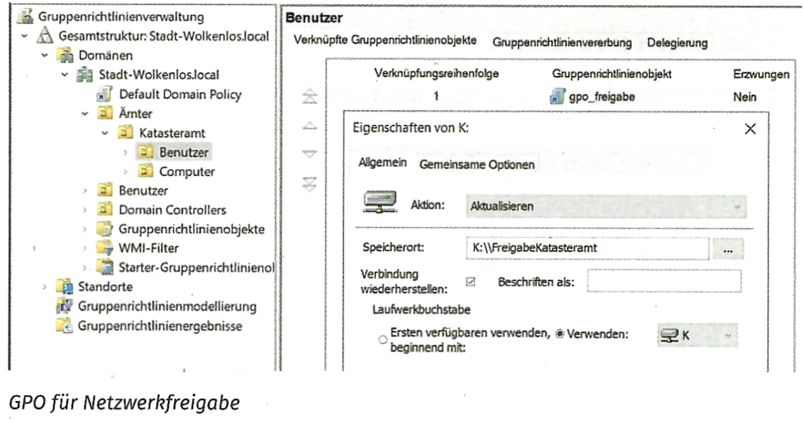
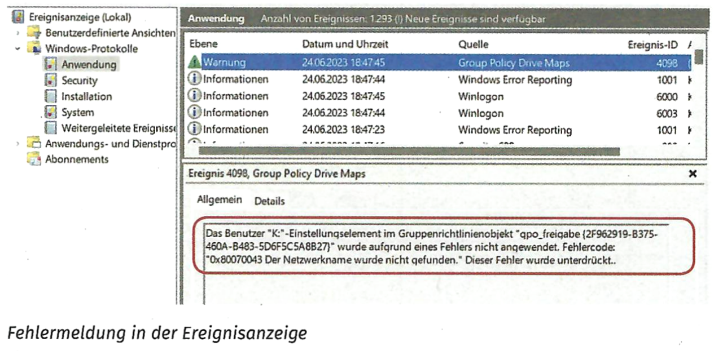

::: {.task}
## Aufgabe 1

Das Katasteramt der Stadt Wolkenlos hat einen weiteren Auftrag für Sie.
Für die automatische Einbindung der Netzwerkfreigabe
„FreigabeKatasteramt" auf dem Server „`\fileserver`" wurde eine
Gruppenrichtlinie implementiert. Der Screenshot zeigt die Konfiguration.

Bei der Anmeldung eines Benutzers bemerken Sie, dass die
Netzwerkfreigabe nicht wie gewünscht auf dem Client unter
„`K:\FreigabeKatasteramt`" eingebunden wird.

Eine Überprüfung der auf dem Client geladenen Gruppenrichtlinie zeigt,
dass das entsprechende GPO richtig geladen wurde. Die Ereignisanzeige
des Clients zeigt den in der Abbildung gezeigten Eintrag.

Beschreiben Sie, welcher Fehler in der Konfiguration gemacht wurde und
wie er zu beheben ist.




:::

::: {.task}
## Aufgabe 2

Zur Dokumentation von Konfigurationen ist die Nutzung von Skripten
sinnvoll. Auf einem Dateiserver sollen zwei Freigaben eingerichtet und
die entsprechenden Gruppen nach dem AGDLP-Schema konfiguriert werden.
Die Daten werden aus einer JSON-Datei eingelesen, die folgendermaßen
aufgebaut ist:

``` json
{
  "freigabeArray": [
    "FreigabeKatasteramt",
    "FreigabeKartografie"
  ],
  "gruppenArray": [
    "Katasteramt",
    "Kartografie"
  ],
  "zugriffsObjekt": {
    "FreigabeKatasteramt": {
      "Katasteramt": "rw"
    },
    "FreigabeKartografie": {
      "Kartografie": "rw"
    }
  }
}
```

- freigabeArray: enthält als Array alle Freigaben, die erstellt werden
  sollen.

- gruppenArray: enthält als Array alle Gruppen, die erstellt werden
  sollen. Nach dem AGDLP-Schema soll jeweils eine globale und eine
  domänenlokale Gruppe erstellt werden. Als Nomenklatur werden die
  Präfixe glg\_ und dlg\_ den Gruppennamen vorangestellt.

- zugriffsObjekt: enthält Schlüssel-Wert-Paare, mit denen den Freigaben
  die domänenlokalen Gruppen zugeordnet werden. Die Zugriffsrechte sind
  hier vereinfacht als „rw" für Lese-Schreibrechte angegeben.

Erstellen Sie ein Programm (in Pseudocode), das eine JSON-Datei einliest
und mit Pseudobefehlen die nachfolgenden Funktionen abbildet:

- die Freigaben anlegen

- die globalen Gruppen anlegen

- die domänenlokalen Gruppen anlegen

- die domänenlokalen Gruppen mit den vorgegebenen Zugriffsrechten den
  Freigaben zuordnen

- die jeweils domänenlokale mit der globalen Gruppe verknüpfen
:::

::: {.task}
## Aufgabe 3

a)  ::: {.subtask}
    Sie installieren in Ihrer Testumgebung eine Zertifizierungsstelle.
    Beim Installieren können Sie Verschlüsselungsparameter für die
    Zertifikate auswählen.

    Folgende Parameter und Werte können gewählt werden:

    | Parameter | Werte |
    |----|----|
    | Algorithmus zum Erzeugen des Schlüsselpaars | RSA, EC, oct |
    | Algorithmus zur Signatur | RSA_SHA1, RSA_SHA256, ECDSA_SHA256 |
    | Schlüssellänge | 2048 Bit, 3072 Bit, 4096 Bit |
    | Algorithmus zur Verschlüsselung | DES, Triple-DES, RSA, AES |
    | Algorithmus zur Hash-Wertbildung | MD5, SHA-2, SHA256 |

    Treffen Sie eine Auswahl der Parameter und begründen Sie Ihre
    Auswahl kurz.

    | Parameter                                                                   | gewählter Wert | Begründung |
    |----|----|----|
    | Algorithmus Schlüsselpaar | EC | liefert die gleiche Verschlüsselungsstärke wie RSA mit kürzerer Schlüssellänge |
    | Algorithmus Signatur |  |  |
    | Schlüssellänge |  |  |
    | Algorithmus Verschlüsselung |  |  |
    | Algorithmus Hash-Wertbildung |  |  |
    :::

<!-- -->

b)  ::: {.subtask}
    Im Laufe der weiteren Installation müssen Sie die Certificate
    Revokation List (CRL) konfigurieren.

    Ein Auszubildender schaut Ihnen bei der Konfiguration über die
    Schulter. Er fragt Sie nach der Aufgabe der CRL.

    Erläutern Sie die Hauptaufgabe der Certificate Revokation List
    (CRL).
    :::
:::
