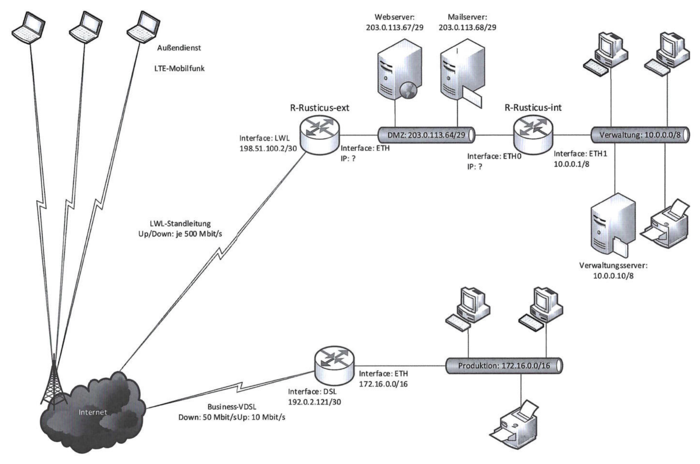

## Aufgabe 1

In [\$64 BDSG](https://www.gesetze-im-internet.de/bdsg_2018/__64.html)
werden 14 Kontrollbereichen benannt. Geben Sie zu Zugangskontrolle,
Speicherkontrolle, Benutzerkontrolle und Wiederherstellbarkeit TOMs im
Zusammenhang mit Netzwerken und Servern im Unternehmen an.

::: {.solution}
1.  Zugangskontrolle

    Verwehrung des Zugangs zu Verarbeitungsanlagen, mit denen die
    Verarbeitung durchgeführt wird, für Unbefugte

    - Serverraum mit Zugangskontrolle (z. B. Transponder,
      Schlüsselkarte, biometrische Zugangskontrolle, Schlüssel, PIN),
    - abschließbare Netzwerkschränke
    - Festlegung von Zutrittsbrechtigungen

2.  Speicherkontrolle

    Verhinderung der unbefugten Eingabe von personenbezogenen Daten
    sowie der unbefugten Kenntnisnahme, Veränderung und Löschung von
    gespeicherten personenbezogenen Daten

    - Authentifikation und Autorisierung des Zugriffs auf Daten und
      entsprechende Anwendungen zur Verarbeitung dieser Daten.

    - Schulungen zum sicheren Umgang

3.  Benutzerkontrolle

    Verhinderung der Nutzung automatisierter Verarbeitungssysteme mit
    Hilfe von Einrichtungen zur Datenübertragung durch Unbefugte

    - Authentifikation und Autorisierung des Zugriffs, Vergabe von Rolen
      und Pflege der Zugänge.
    - MFA
    - individuelle Bentuzerkonten

4.  Wiederherstellbarkeit

    Gewährleistung, dass eingesetzte Systeme im Störungsfall
    wiederhergestellt werden können.

    - Implementierung von regelmäßigen Backups, Einhaltung von
      Best-Practices, 3-2-1
    - Testen von Backups
:::

## Aufgabe 2

Ordnen Sie folgende Begriffe korrekt zu:

- Antiviren-Scanner
- Deep Packet Inspektion
- DMZ
- Firewall
- Patches
- HTTPS
- IDS
- IPS
- NGFW
- PAP-Struktur
- Perimeterbereich
- Paketfilter
- VPN
- Whitelist

a)  Programme, die übertragene Dateien und Kommunikationsdaten auf
    Malware überprüfen.
b)  Der Softwareentwickler bietet ein Sicherheitsupdate an.
c)  Die Webseite läuft über einen Sicherheitsserver.
d)  Mit Clients erfolgt die Kommunikation über eine verschlüsselte
    Tunnelverbindung.
e)  Zum Schutz vor Angriffen auf das interne Netz werden zwei
    Paketfilter und ein Schicht-7-Gateway gefordert.
f)  Bereich ab der Grenze zum externen Netz
g)  Zwischensicherheitszone für Server, die nicht im internen Netz
    eingebunden sind
h)  Besonders effektive Schutzeinheit auf den OSI-Schichten 2--7
i)  Schutzeinheit auf den OSI-Schichten 2 und 3
j)  Software, die IP-Adressen und Ports filtert und nach Regeln
    entscheidet
k)  Malware-Erkennungstool, das Pakete nach Regeln und
    Kontrollfunktionen danach prüft, ob es diese blockieren kann.
l)  Sicherheitstool, das ein Netzwerk überwacht und Angriffe erkennt,
    aber nicht abwehrt
m)  Sicherheitsverfahren in Firewalls, um neben dem Header auch
    verschlüsselte Inhalte zu filtern
n)  Liste mit erwünschten Absendern

::: {.solution}
a)  Programme, die übertragene Dateien und Kommunikationsdaten auf
    Malware überprüfen. → Antiviren-Scanner
b)  Der Softwareentwickler bietet ein Sicherheitsupdate an. → Patches
c)  Die Webseite läuft über einen Sicherheitsserver. → HTTPS
d)  Mit Clients erfolgt die Kommunikation über eine verschlüsselte
    Tunnelverbindung. → VPN
e)  Zum Schutz vor Angriffen auf das interne Netz werden zwei
    Paketfilter und ein Schicht-7-Gateway gefordert. → PAP-Struktur
f)  Bereich ab der Grenze zum externen Netz → Perimeterbereich
g)  Zwischensicherheitszone für Server, die nicht im internen Netz
    eingebunden sind → DMZ
h)  Besonders effektive Schutzeinheit auf den OSI-Schichten 2--7 → NGFW
i)  Schutzeinheit auf den OSI-Schichten 2 und 3 → Firewall
j)  Software, die IP-Adressen und Ports filtert und nach Regeln
    entscheidet → Paketfilter
k)  Malware-Erkennungstool, das Pakete nach Regeln und
    Kontrollfunktionen danach prüft, ob es diese blockieren kann. → IPS
l)  Sicherheitstool, das ein Netzwerk überwacht und Angriffe erkennt,
    aber nicht abwehrt → IDS
m)  Sicherheitsverfahren in Firewalls, um neben dem Header auch
    verschlüsselte Inhalte zu filtern → Deep Packet Inspektion
n)  Liste mit erwünschten Absendern → Whitelisting
:::

## Aufgabe 3

Ordnen Sie die Begriffe den Aussagen passend zu

(1) Angriffsvektor
(2) APT
(3) BSI
(4) DoS
(5) DSGVO
(6) Echtheit/Überprüfbarkeit
(7) Malware
(8) Man-in-the-Middle
(9) PDCA
(10) Ping Flooding
(11) PUA
(12) Ransomware
(13) S/MIME
(14) Single-Sign-on
(15) Spam
(16) Trojaner
(17) Verfügbarkeit
(18) Vertraulichkeit
(19) Whitelisting
(20) Würmer

#### Aussagen

a)  Bundesamt für Cybersicherheit (Kurzform)

b)  Gesetzliches Regelwerk zum Schutz persönlicher Daten

c)  Grundwert Availability im Deutschen

d)  Grundwert Confidentiality im Deutschen

e)  Grundwert Authenticity im Deutschen

f)  Deming-Zyklus

g)  Kombination aus Angriffsweg und Angriffstechnik

h)  Allgemeiner englischer Begriff für Schadsoftware

i)  Schadsoftware, die sich von selbst übertragen kann

j)  Schadsoftware, die Hintertüren im System öffnet

k)  Englische Kurzform für ungewünschte Anwendung

l)  Schadprogramme, die alles verschlüsseln und erpressen

m)  Angriff, der Server durch viele Anfragen überlastet

n)  Server sind durch diesen Angriff außer Betrieb, gestört

o)  Andauernder Cyberangriff auf das Netzwerk

p)  Serverangriffe durch Erreichbarkeitsüberprüfungen

q)  Angriffe durch Einmischung in Kommunikationen

r)  Vereinfachte Anmeldung im System

s)  Asymmetrisches Verschlüsselungsverfahren

t)  Zusammenstellung vertrauenswürdiger Quellen/Apps

::: {.solution}
a)  Bundesamt für Cybersicherheit (Kurzform) → (3) BSI

b)  Gesetzliches Regelwerk zum Schutz persönlicher Daten → (5) DSGVO

c)  Grundwert Availability im Deutschen → (17) Verfügbarkeit

d)  Grundwert Confidentiality im Deutschen → (18) Vertraulichkeit

e)  Grundwert Authenticity im Deutschen → (6) Echtheit/Überprüfbarkeit

f)  Deming-Zyklus → (9) PDCA Plan-Do-Check-Act-Modell

g)  Kombination aus Angriffsweg und Angriffstechnik → (1) Angriffsvektor

h)  Allgemeiner englischer Begriff für Schadsoftware → (7) Malware

i)  Schadsoftware, die sich von selbst übertragen kann → (20) Würmer

j)  Schadsoftware, die Hintertüren im System öffnet → (16) Trojaner

k)  Englische Kurzform für ungewünschte Anwendung → (11) PUA
    (Potentially Unwanted Application)

l)  Schadprogramme, die alles verschlüsseln und erpressen → (12)
    Ransomware

m)  Angriff, der Server durch viele Anfragen überlastet → (4) DoS
    (Denial of Service)

n)  Server sind durch diesen Angriff außer Betrieb, gestört → (15) DoS
    (Spam)

o)  Andauernder Cyberangriff auf das Netzwerk → (2) APT (Advanced
    Persistent Threat)

p)  Serverangriffe durch Erreichbarkeitsüberprüfungen → (10) Ping
    Flooding

q)  Angriffe durch Einmischung in Kommunikationen → (8)
    Man-in-the-Middle

r)  Vereinfachte Anmeldung im System → (14) Single-Sign-on

s)  Asymmetrisches Verschlüsselungsverfahren → (13) S/MIME

t)  Zusammenstellung vertrauenswürdiger Quellen/Apps → (19) Whitelisting
:::

## Aufgabe 4

Erläutern Sie die folgenden sieben Begriffe

a)  Aktive Netzwerkkomponenten

    ::: {.solution}
    Aktive Netzwerkkomponenten sind alle Geräte, die aktiv Signale
    verarbeiten bzw. verstärken können (Netzwerkgeräte). Sie benötigen
    dazu eine Stromversorgung. Zu dieser Gruppe gehören Hubs und
    Switches, Router, Bridges, Firewalls und Session Border Controller.
    :::

<!-- -->

b)  DHCP

    ::: {.solution}
    Das Dynamic Host Configuration Protocol (DHCP) ist ein
    Netzwerkprotokoll, das die Zuweisung der Netzwerkkonfiguration an
    Clients durch einen Server ermöglicht.
    :::

<!-- -->

c)  DMZ

    ::: {.solution}
    Eine Demilitarisierte Zone (DMZ, auch Demilitarized Zone, Perimeter-
    oder Umkreisnetzwerk) bezeichnet ein Computernetz mit
    sicherheitstechnisch kontrollierten Zugriffsmöglichkeiten auf die
    daran angeschlossenen Server.
    :::

<!-- -->

d)  DNS

    ::: {.solution}
    Das Domain Name System, deutsch Domain-Namen-System ist ein
    hierarchisch unterteiltes Bezeichnungssystem in einem meist
    IP-basierten Netz zur Beantwortung von Anfragen zu Domain-Namen
    (Namensauflösung).
    :::

<!-- -->

e)  Firewall

    ::: {.solution}
    Eine Firewall ist ein Sicherungssystem, das ein Rechnernetz oder
    einen einzelnen Computer vor unerwünschten Netzwerkzugriffen
    schützt.
    :::

<!-- -->

f)  IPS

    ::: {.solution}
    Als Intrusion-Prevention-Systeme (kurz: IPS) werden
    Intrusion-Detection-Systeme (kurz: IDS) bezeichnet, die über die
    reine Generierung von Ereignissen (Events) hinaus Funktionen
    bereitstellen, die einen entdeckten Angriff abwehren können.
    :::

<!-- -->

g)  Proxy

    ::: {.solution}
    Ein Proxy ist eine Kommunikationsschnittstelle in einem Netzwerk aus
    Rechnern in Form eines Servers. Er arbeitet als Vermittler, der auf
    der einen Seite Anfragen entgegennimmt, um dann über seine eigene
    Adresse eine Verbindung zur anderen Seite herzustellen.

    Wird der Proxy als Netzwerkkomponente eingesetzt, bleibt einerseits
    die tatsächliche Adresse eines Kommunikationspartners dem jeweils
    anderen Kommunikationspartner verborgen, was eine gewisse Anonymität
    schafft. Als (mögliches) Verbindungsglied zwischen unterschiedlichen
    Netzwerken kann er andererseits eine Verbindung zwischen
    Kommunikationspartnern selbst dann realisieren, wenn deren Adressen
    zueinander inkompatibel sind und eine direkte Verbindung nicht
    möglich ist.
    :::

## Aufgabe 5

Die Schutzbedarfsanalyse ist Teil des Sicherheitsprozesses. Ordnen Sie
die Reihenfolge der Teilaspekte des Sicherheitsprozesses.

- Organisation des Sicherheitéprozesses

- Sicherheitsprozess initiiert

- Erstellung einer Sicherheitskonzeption

- Leitlinie zur Informationssicherheit

- Sicherheitsprozess verbessern

- Sicherheitskonzeption umgesetzt

::: {.solution}
1.  Sicherheitsprozess initiiert

2.  Leitlinie zur Informationssicherheit

3.  Organisation des Sicherheitéprozesses

4.  Erstellung einer Sicherheitskonzeption

5.  Sicherheitskonzeption umgesetzt

6.  Sicherheitsprozess verbessern

(Vgl. Buch S. 173)
:::

## Aufgabe 6

Nennen Sie zwei Sicherheitsrisiken, die den Betrieb eines Webservers
betreffen.

::: {.solution}
1.  SQL-Injection: Bei diesem Angriff nutzt ein Angreifer Schwachstellen
    in Webanwendungen, um über Eingabefelder bösartigen SQL-Code in die
    Datenbank zu schleusen. Dadurch kann der Angreifer auf vertrauliche
    Daten zugreifen, diese manipulieren oder löschen. Besonders
    betroffen sind unsichere Formulare oder URL-Parameter, die direkt in
    SQL-Abfragen eingebunden werden.

2.  Cross-Site Scripting (XSS): Dieser Angriff erfolgt, wenn eine
    Webanwendung unsichere Benutzereingaben in Webseiten integriert,
    ohne sie ausreichend zu überprüfen oder zu bereinigen. Ein Angreifer
    kann bösartigen Code (meist JavaScript) einschleusen, der dann von
    anderen Nutzern ausgeführt wird. Dies kann zu Datendiebstahl,
    Manipulation der Benutzeroberfläche oder der Kontrolle über
    Nutzerkonten führen.

3.  Unbefungter Zugriff durch unsichere Passwörter

4.  Schwachstellen in der Implementierung, der Unbefugten Zugang zu
    geschützten Daten erlaubt.
:::

## Aufgabe 7

Beschreiben Sie die Begriffe

- Baiting

- Phishing

- Dumpster Diving

in eigenen Worten.

::: {.solution}
- Baiting (dt. »Ködern«) beschreibt eine Technik, bei der gezielt in der
  Umgebung einer Firma beispielsweise manipulierte USB-Sticks ausgelegt
  werden (z. B. ein »Rubber Ducky«).

- Phishing (Wortschöpfung aus Phreaking und Fishing) ist eine Form des
  Social Engineering, um vertrauliche persönliche Informationen wie
  Anmeldedaten oder Kreditkartennummern zu erhalten oder den Empfänger
  zur Ausführung einer für ihn schädlichen Handlung zu bewegen.

- Der Abfall (z. B. Papiermüll mit persönlichen Informationen) der
  anzugreifenden Person oder Organisation wir zur Gewinnung von
  gezielten Informationen genutzt. Diese kann z. B. für eine gezielte
  Phishing-Attacke verwendet werden.

Vgl. Buch S. 185--186
:::

## Aufgabe 8

Ein wirtschaftlicher Schaden durch den Ausfall von IT-Systemen kann
mehrere Gründe haben. Neben dem Ausfall durch einen Hackerangriff gibt
es weitere Kategorien, die zu einem Ausfall führen können. Nennen Sie
drei Gefährdungskategorien, die zu einem Ausfall von IT-Systemen führen
können.

::: {.solution}
- Höhere Gewalt (Blitzschlag, Feuer, Überschwemmung, Erdbeben, Streik)

- Fahrlässigkeit (Irrtum, Fehlbedienung, Unsachgemäße Behandlung)

- Vorsatz (Einbruch, Hacking, Spionage, Manipulation, Sabotage,
  Vandalismus)

- Technisches Versagen (Stromausfall, Hardwareausfall, Fehlfunktion)

- Organisatorische Mängel (Unberechtigter Zugriff, Lizenzverletzungen,
  Ungeschultes Personal)
:::

## Aufgabe 9

Beschreiben Sie, welche Konsequenzen Unternehmen drohen, wenn sie
Sicherheitbedrohungen nicht erfolgreich abwehren können.

::: {.solution}
Je nach Schadensausmaß kann ein IT-Sicherheitsvorfall zum
Betriebsstillstand, Imageverlust oder im Extremfall sogar zur Insolvenz
bzw. Unternehmensaufgaben führen. Ggf. können auch die Gesundheit oder
das Leben von Personen bedroht werden. In leichteren Fällen werden
Betriebsaufläufe gestört und/oder Ressourcen durch Fremde beansprucht
und es können finanzielle Schäden mit begrenztem Ausmaß auftreten.
:::

## Aufgabe 10

Nennen Sie fünf Beispiele für Gefährdungen für Server.

::: {.solution}
- Ausfall oder Störung der Stromversorgung.
- Ausfall oder Störung von Kommunikationsnetzen
- Ausspähen von Informationen und Spionage
- Unbefugtes Eindringen in IT-Systeme
- Ausfall von Geräten oder Systemen
- Unberechtigte Nutzung oder Administration von Geräten oder Netzen
- Fehlerhafte Nutzung oder Administration von Geräten oder Netzen
- Missbrauch von Berechtigungen ...
:::

## Aufgabe 11

Das BSI empfiehlt eine Speicherung der Daten an unterschiedlichen Orten,
die mindestens 200 km voneinander entfernt liegen sollen. Erklären Sie,
warum die Orte so weit voneinander entfernt liegen sollten.

::: {.solution}
Durch die räumliche Distanz wird es unwahrscheinlicher, dass beide
Standorte durch dieselbe Katastrophe betroffen sind.
:::

## Aufgabe 12

In einem Unternehmen gab es einen Datenverlust. Beschreiben Sie zwei
Auswirkungen des Datenverlustes in Bezug auf wirtschaftlichen Schaden
für das Unternehmens.

::: {.solution}
- Aufträge können mangels Daten nicht bearbeitet werden, d. h. der
  Betrieb steht (teilweise) still. Dadurch stehen den Betriebskosten für
  diese Phase keine Einnahmen gegenüber.

- Falls Kunden- oder (Ab-)Rechnungsdaten verloren gehen, können z. B.
  Rechnung nicht erstellt werden und die Einnahmen sind möglicherweise
  verloren.
:::

## Aufgabe 13

a)  Beim Social Engineering werden menschliche Eigenschaften ausgenutzt,
    um diese für einen Angriff zu verwenden.

    Nennen Sie zwei menschliche Eigenschaften, die ausgenutzt werden
    könnten und beschreiben Sie zu diesen Eigenschaften jeweils ein
    Beispiel für einen Social Engineering-Angriff.

    ::: {.solution}
    - Neugierde: Menschen werden dazu verleitet, auf einen Link zu
      klicken

    - Hilfsbereitschaft
    :::

<!-- -->

b)  Unterscheiden Sie die Angriffe „Spear Phishing" und „Phishing".

    ::: {.solution}
    Im Gegensatz zum Phishing wir beim Spear Phishing gezielt ein ganz
    bestimmtes Opfer gewählt und die Attacke auf diese Person
    ausgerichtet.
    :::

<!-- -->

c)  Notieren Sie zwei Beispiele für einen Identitätsmissbrauch.

    ::: {.solution}
    - Zugriff auf das Bankkonto oder Konto eines Online-Shops einer
      anderen Person, um Geld zu transferieren oder Waren im Namen
      dieser Person zu bestellen.

    - Zugriff auf vertrauliche Daten oder administrative Zugänge, um
      z. B. an Unternehmensdaten zu gelangen.

    - Deep-Fakes mithilfe von KI zur Manipulation
    :::

<!-- -->

d)  Beschreiben Sie, was unter dem Begriff „Doxing" verstanden wird.

    ::: {.solution}
    Doxing (von englisch dox, Abkürzung für documents ‚Dokumente'), auch
    Doxxing, ist das internetbasierte Zusammentragen und anschließende
    Veröffentlichen personenbezogener Daten, typischerweise mit
    bösartigen Absichten gegenüber den Betroffenen.
    :::

<!-- -->

e)  Erklären Sie den Begriff „Dreifacherpressung" im Zusammenhang mit
    einem Ransomware-Angriff.

    ::: {.solution}
    1.  Zahlung für den Schlüssel, um die Daten zu entschlüsseln.
    2.  Versicherung, dass die Daten nicht veröffentlicht werden.
    3.  Zusicherung, dass keine DDoS-Angriffe auf das Unternehmen
        durchgeführt werden oder keine Kontaktaufnahme mit einzelnen
        Opfern stattfinden wird.
    :::

<!-- -->

f)  Beschreiben Sie warum nach einem Ransomware-Angriff in der Regel
    alle Rechner des angegriffenen Netzwerks heruntergefahren werden.

    ::: {.solution}
    Dadurch soll eine weitere Verbreitung der Ransomware vermieden
    werden und eine Analyse der verwendeten Ransomware ermöglicht
    werden.
    :::

<!-- -->

g)  Beschreiben Sie den Begriff „Ransomware-as-a-Service (RaaS)" und
    warum dadurch eine Analyse der Angreifer erschwert wird.

    ::: {.solution}
    Spezialisierte Cyber-Kriminelle bieten die Nutzung ihrer Software
    als Service an. Dadurch ist der Auftraggeber nicht (direkt)
    erkennbar.
    :::

## Aufgabe 14

Fünf Überwachungs-Kameras sollen eine Auflösung von 1024 x 768 mit einer
Farbtmfe von 8 Bit besitzen. Die Kameras sollen mit 25 fps filmen. Die
Daten werden nach einem Tag überschrieben.

Ermitteln Sie die nötige Datenmenge in TiB (gerundet auf 2
Nachkommastellen).

::: {.solution}
    5 * (1024 * 768 * 25 * 3600 * 24) / 2^40 = 7,72 TiB
:::

## Aufgabe 15

Ein Kunde möchte den Schutz seiner Endgeräte überarbeiten.

a)  Für einen sinnvollen Schutz des Endgeräts ist die Zugriffsregelung
    auf die Geräte von hoher Bedeutung. Recherchieren Sie drei Methoden,
    den Zugriff auf ein Gerät zu regeln.

    ::: {.solution}
    - Benutzeranmeldung
    - Sperren des Gerätes nach einer bestimmten Zeitdauer der
      Inaktivität
    - Sichern der Hardware (z. B. Laptop) gegen Diebstahl durch
      Kabelschloss
    - Gesichtserkennung
    - Fingerabdruckscanner
    - Karten oder Sticks
    :::

<!-- -->

b)  Die Daten eines Endsystems müssen gesichert werden. Dazu werden
    regelmäßige Backups erstellt. Entscheiden Sie, welche Art von Daten
    eines Benutzerendsystems mittels Backup gesichert werden sollen.

    ::: {.solution}
    - Daten, die vom Benutzer bearbeitet und/oder erstellt werden (z. B.
      Office-Dokumente, Notizen, Bilder, Dateien zu Projekt, Quellcode)

    - Daten des Betriebssystems oder von Anwendungen brauchen nur dann
      gesichert werden, wenn diese individuell erstellt werden, mit
      einem hohen Aufwand bei der Wiederherstellung verbunden wären und
      nicht zentral verwaltet werden.

    - E-Mails und Kontakte

    - Benutzerprofil
    :::

## Aufgabe 16

Beschreiben Sie, was unter der Trennung von Betriebssystem- und
Datenadministration verstanden wird.

::: {.solution}
#### Serveradministratior

- kann Dateien anlegen, manipulieren und löschen
- kann Programme auf dem Server installieren
- kann Benutzer anlegen

#### DB-Administratior

- administriert die Datenbankanwendung
- kann neue DBs anlegen
- kann Tabellen anlegen, manipulieren und löschen
- kann DB-Benutzer anlegen
- hat *keinen* Zugriff auf die Rechte des Server-Administrators
:::

## Aufgabe 17

Nennen Sie Möglichkeiten, um Windows-Clients aktuell zu halten.

::: {.solution}
- Paketmanager (Chocolately for Business)  
- Microsoft Store
  - Microsoft Store for Business
  - Microsoft Store for Education
- Windows Server Update Service (WSUS)
- Deployment-Software wie Deskcenter, Empirum, Microsoft Endpoint
  Configuration Mananger (MECM)
:::

## Aufgabe 18

Geben Sie die Möglichkeiten an, mit denen die VLAN-Zugehörigkeit
umgesetzt werden kann.

::: {.solution}
- statisch über Portzuordnung an den Switches
- Markierungen (Tags) an den Paketen
- dynamisch (MAC-Adressen, IP-Adressen, TCP-Ports, UDP-Ports und höhere
  Potokolle)
- Zuordnung nach Authentifizierung, z. B. mittels 802.1X
:::

## Aufgabe 19

a)  Auf dem Router wird eine Firewall betrieben, zu deren
    Funktionsumfang äücfi SPI (Stateful Packet Inspection) zählt.
    Erläutern Sie die Unterschiede einer Firewall mit aktivierter
    SPI-Funktion im Vergleich zu einer Firewall mit deaktivierter
    SPI-Funktion.

    ::: {.solution}
    SPI sorgt dafür, dass Antworten für erlaubten Traffic bis zum
    Verbindungsabbau oder für einen bestimmten Zeitraum automatisch
    ebenfalls die Firewall passieren dürfen, ohne dass dafür manuell
    Regeln aufgestellt werden müssen.
    :::

<!-- -->

b)  Stellen Sie für folgende Situationen passende Regeln für die
    Firewall an R-Rusticus-ext auf, die den Traffic aus dem Internet
    regulieren:

    - Der Webserver soll von außen über HTTP erreichbar sein.
    - Der Webserver soll von außen über HTTPS erreichbar sein.
    - Andere Mailserver können Mails beim Mailserver über SMTP
      einliefern.
    - Mails können mit dem Protokoll IMAP vom Mailserver abgerufen
      werden.
    - Aller anderer Traffic aus dem Internet wird verworfen.

    | Aktion | Protokoll | Quell-IP-Adresse | Ziel-IP-Adresse | Quell-Port | Ziel-Port | Von Interface | Nach Interface |
    |----|----|----|----|----|----|----|----|
    |  |  |  |  |  |  |  |  |
    |  |  |  |  |  |  |  |  |
    |  |  |  |  |  |  |  |  |
    |  |  |  |  |  |  |  |  |
    |  |  |  |  |  |  |  |  |
    |  |  |  |  |  |  |  |  |

    :::: {.solution}
    ::: {text="2xs"}
    | Aktion | Protokoll | Quell-IP-Adresse | Ziel-IP-Adresse                          | Quell-Port | Ziel-Port | Von Interface | Nach Interface |
    |----|----|----|----|----|----|----|----|
    | Permit | TCP | any | 203.0.133.67/32 | any | 80 | LWL | ETH |
    | Permit | TCP | any | 203.0.133.67/32 | any | 443 | LWL | ETH |
    | Permit | TCP | any | 203.0.133.68/32 | any | 25 | LWL | ETH |
    | Permit | TCP | any | 203.0.133.68/32 | any | 143 | LWL | ETH |
    | DENY | IP | any | any | any | any | LWL | ETH |
    |  |  |  |  |  |  |  |  |
    :::
    ::::

<!-- -->

c)  Es sollen die zusätzlichen Dienste eingerichtet werden. Entscheiden
    Sie, ob diese in der DMZ oder im internen Netzwerk platziert werden
    sollten.

    - DNS-Server
    - FTP-Server
    - Anwendungsserver für die Produktion
    - HTTP-Proxy-Server
    - Druckerserver
    - DHCP-Server

    ::: {.solution}
    - DNS-Server → DMZ
    - FTP-Server → DMZ, falls der FTP auch aus dem Internet erreichbar
      sein soll, ansonsten internes Netzwerk
    - Anwendungsserver für die Produktion → internes Netzwerk
    - HTTP-Proxy-Server → DMZ
    - Druckerserver → internes Netzwerk
    - DHCP-Server → internes Netzwerkx
    :::

## Aufgabe 20

Erläutern Sie den Aufbau einer P-A-P-Struktur.

::: {.solution}
Eine P-A-P-Struktur besteht aus Paketfilter, Application Layer Gateway
(ALG) bzw. Sicherheits-Proxys und Paketfilter (NGFW).

Die interne Firewall muss die Angriffsfläche des ALGs oder der
Sicherheits-Proxys gegenüber Innentätern oder IT-Systemen im internen
Netz reduzieren.

Der Application Level Gateway fungiert als Proxy-Server mit Virenscanner
und untersucht die auf der Anwendungsschicht arbeitenden Protokolle
E-Mail, HTTP usw.
:::

## Aufgabe 21

Erklären Sie, was ein VPN ist und inwiefern es zur IT-Sicherheit
beiträgt.

::: {.solution}
VPN steht für Virtual Private Network.

VPNs sind in sich geschlossene, logische Netze auf unterschiedlichen
Schichten des OSI-Referenzmodells. Sie arbeiten auf den unteren
Schichten und verwenden Tunneling für den IP-Datenverkehr.

Durch das VPN wir der Datenverkehr in Echtzeit durch einen
verschlüsselten virtuellen Tunnel geleitet, die IP-Adresse und damit die
Online-Identität werden verschleiert.

Ein VPN schützt nicht davor, Dass Daten auf Endgeräten geschädigt oder
ausgespäht werden.
:::

## Aufgabe 22

Erläutern Sie die folgenden Begriffe.

a)  NGFW

    ::: {.solution}
    Eine Firewall, die ausgeklügelte Angriffe erkennt und blockiert,
    indem sie Sicherheitsrichtlinien auf Anwendungs-, Port- und
    Protokollebene durchsetzt.

    Grundfunktionen sind Enterprise-Firewall-Fähigkeiten, ein IPS und
    Anwendungskontrolle.

    I. d. R. umfassen NGFWs Deep-Packet-Inspection-Funktionen, z. B.
    indem sie TLS-/SSL-verschlüsselten Datenverkehr überprüfen.
    Virenschutzprüfung
    :::

<!-- -->

b)  Paketfilter

    ::: {.solution}
    Filterung von Datenpaketen anhand von Filterregeln, die sich auf
    Ports und IP-Adressen der Quell- und Zielsysteme beziehen.
    Unzulässige Pakete werden verworfen, zulässige durchgelassen oder
    weitergeleitet.
    :::

<!-- -->

c)  IDS

    ::: {.solution}
    Ein Intrusion Detection System erkennt Einbruchsversuche anhand von
    Kommunikationsmustern und meldet diesen.
    :::

<!-- -->

d)  IPS

    ::: {.solution}
    Als Intrusion-Prevention-Systeme (kurz: IPS) werden
    Intrusion-Detection-Systeme (kurz: IDS) bezeichnet, die über die
    reine Generierung von Ereignissen (Events) hinaus Funktionen
    bereitstellen, die einen entdeckten Angriff abwehren können.
    :::

<!-- -->

e)  Deep Packet Inspection

    ::: {.solution}
    Verfahren der Netzwerktechnik und von Firewalls, um Datenpakete
    sowohl anhand vom Header als auch vom Dateninhalt zu überwachen und
    zu filtern. Dabei werden weitergehende, besonders
    protokollspezifische Informationen analysiert.
    :::

<!-- -->

f)  Advanced Threat Protection

    ::: {.solution}
    Die Advanced Threat Protection erkennt Bots und komplexe
    Bedrohungen, z. B. umfangreiche Angriff über einen längeren
    Zeitraum.
    :::

<!-- -->

g)  Sicherheits-Gateway

    ::: {.solution}
    Für den normalen Schutzbedarf besteht es im Allgemeinen aus
    mehreren, in Reihe geschalteten Filterkomponenten. Dabei ist
    zwischen Paketfilter und Application Level Gateway (ALG) zu
    unterscheiden.
    :::

## Aufgabe 23

Beschreiben Sie Maßnahmen zur E-Mail-Sicherheit.

::: {.solution}
- Es sollten nur die verschlüsselten Varianten der
  Übertragungsprotokolle POP3S, IMPAS und SMTPS verwendet werden.

- Ein E-Mail-Security-Gateway blockiert Angriffe und verschiebt
  unsichere Inhalte in Quarantäne-Ordner.

- Ein Spamfilter filter anhand von Blocklists oder Allowlists eingehende
  E-Mails anhand der Absender-Adressen.
:::

## Aufgabe 24

Erläutern Sie die Begriffe Multi-Faktor-Authentifizierung und
Single-Sign-on.

::: {.solution}
- Bei der Multi-Faktor-Authentifizierung ist die Kombination von
  mindestens zwei Authentifizierungsmerkmalen wie Passwort, biometische
  Merkmale, Token, Smart Cards usw.

- Bei Single-Sign-on (SSO) gibt es ein zentrales Access-Managament, an
  dem die Authentifizierung für verschiedenen Dienste zusammengeführt
  ist, d. h. nur ein Login-Vorgang für eine Vielzahl von Diensten
  notwendig ist.
:::

## Aufgabe 25

Beschreiben Sie drei Schadenspotenziale in vernetzten Systemen.

::: {.solution}
- Imageschaden

  Ein Imageschaden, z. B. aufgrund von Verstößen gegen die DSGVO, kann
  auch zu geringeren Umsätzen und damit auch sinkenden Gewinnen führen.
  Ist eine seriöser Ruf zentral für das Geschäftsmodell eines
  Unternehmens, kann auch die Existenz des Unternehmens bedroht sein,
  wenn sich aufgrund des Imageschadens eine Vielzahl der Kunden zu
  Konkurrenten wechselt.

- Wirtschaftlicher Schaden

  Der Ausfall von IT-Systemen kann zu Umsatzeinbußen führen, wenn
  bestimmte Geschäftbereiche nicht arbeitsfähig sind. Im Extremfall kann
  der ganze Betrieb stillstehen.

- Schaden durch Datenverlust

  Die Daten können nicht mehr für die Geschäftsprozesse genutzt werden.
  Dies kann auch zu Imageschäden oder wirtschaftlichen Schäden führen,
  z. B. weil der Betrieb stillsteht.
:::

## Aufgabe 26

Beschreiben Sie drei Arten des Datenmissbrauchs.

::: {.solution}
- Beim Social Engineering werden menschliche Eigenschaften wie Neugierde
  und Hilfsbereitschaft ausgenutzt, um diese für einen Angriff zu
  verwenden. Dazu werden u. a. Baiting, Phishing und Dumpster-Diving
  eingesetzt.

- Identitätsmissbrauch werden unrechtmäßig angeeignete Daten verwendet,
  um diese mussbräuchlich zu nutzen, z. B. um Geld zu transferieren oder
  Einkäufe auf Kosten des Opfers zu tätigen. Ebenso können Dienste auf
  Kosten des Opfers genutzt werden.

- Die digitale Erpressung zielt auf die Erpressung von Lösegeld oder
  Handlungen mithilfe von entsprechenden Druckmitteln, die über das
  Internet gesendet werden, z. B. ein Angriff mit Ransomware.
:::

## Aufgabe 27

Beschreiben Sie die Gefährdung durch Vandalismus.

::: {.solution}
Unter Vandalismus wird nicht zielgerichtete Zerstörungswut verstanden.
Meist geht dem Vandalismus unbefugtes Eindringen in die Räume des
Unternehmens voraus. Dabei kommt es häufig zu Diebstahl. der Ausfall von
relevanten Systemen und Datenverlust können die Folge sein. Dieser
Schaden kann den unmittelbaren materiellen Schaden durch den Vandalismus
deutlich übersteigen.
:::

## Aufgabe 28

Erläutern Sie die Arbeitsweise von Virenscannern.

::: {.solution}
Virenscannern erkennen und spezifizieren eine Malware. Anschließend
folgt eine Aktion, z. B. wir eine infizierte Datei entweder gelöscht
oder in ein Quarantäneverzeichnis verschoben.

Viele Virenscanner arbeiten signaturbesiert, d. h. sie such Datenein
nach bekannten Bitmustern ab. Aufgrund der dazu notwendigen
Signaturdatenbank sollten auf einem System nicht zwei Virenscanner
verschiedener Herstellen eingesetzt werden, das sie sich ggf.
gegenseitig als Malware erkennen.
:::
