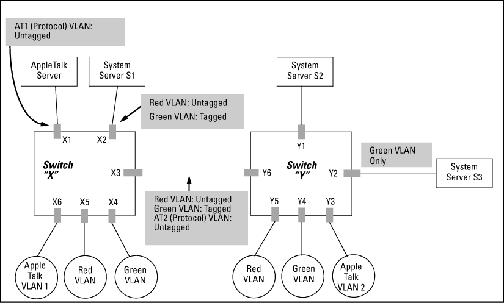

## Aufgabe 1

Für das gegebene Netzwerk sollen die folgenden VLANs eingerichtet
werden:

- 10: Apple Talk VLAN 1
- 20: Apple Talk VLAN 2
- 30: Red VLAN
- 40: Green VLAN

Der Server S2 soll sowohl auf »Red VLAN« als auch auf »Green VLAN«
zugreifen können.

Die Switche X und Y können auch die VLAN-Zugehörigkeit anhand von
Protokollen erkennen, so dass (zusätzlich) ein VLAN für Apple-Talk
ungetaggt bleiben kann.

Erstellen Sie eine geeignete VLAN konfiguration, d. h. die
VLAN-Zugehörigkeiten und tagged oder untagged.

| Switch/Port | VLAN-Konfiguration |
|-------------|--------------------|
|             |                    |
|             |                    |
|             |                    |
|             |                    |
|             |                    |
|             |                    |
|             |                    |
|             |                    |
|             |                    |
|             |                    |
|             |                    |
|             |                    |
|             |                    |

| Rechner / Teilnetz | VLAN-Modus |
|--------------------|------------|
|                    |            |
|                    |            |
|                    |            |
|                    |            |
|                    |            |
|                    |            |
|                    |            |
|                    |            |
|                    |            |
|                    |            |
|                    |            |
|                    |            |
